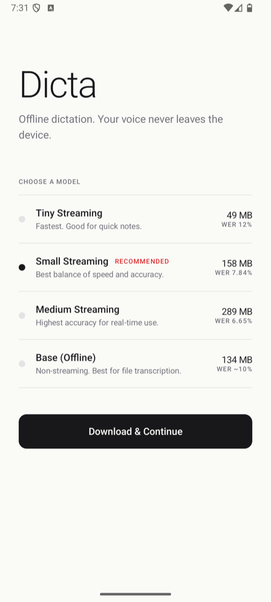
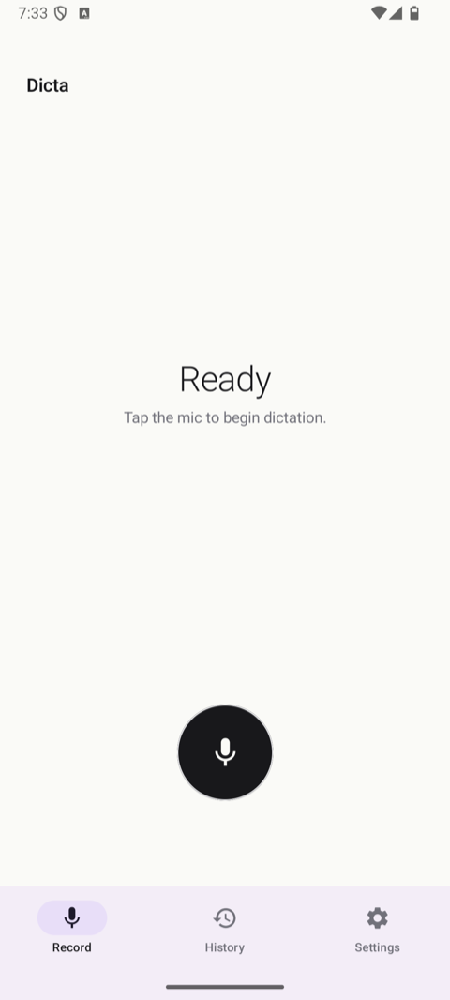
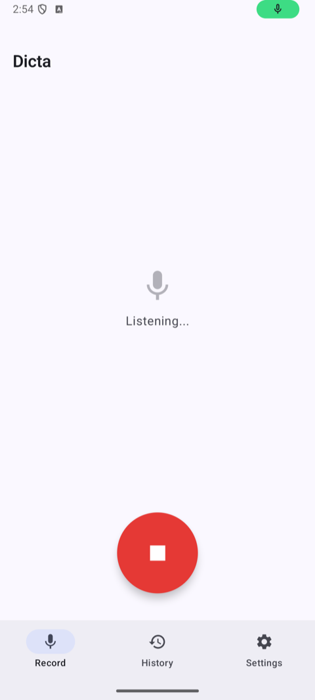
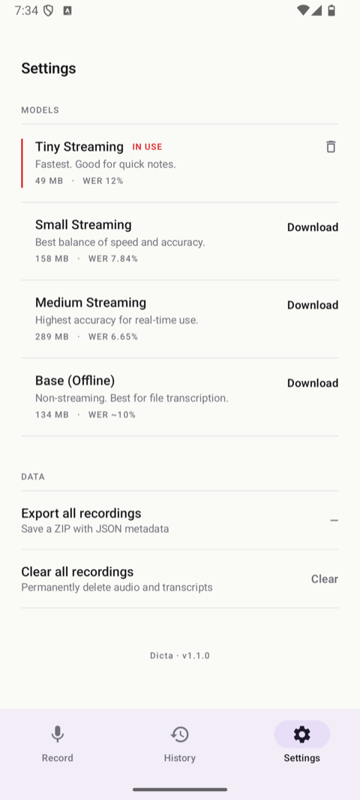

<p align="center">
  
</p>

# Dicta

A modern, minimalistic Android dictation app that uses local/edge ASR (Automatic Speech Recognition) models for fully offline transcription. English-only.

## Features

- **Fully Offline** - All speech recognition happens on-device. No internet required after model download.
- **Real-time Streaming** - See your words transcribed as you speak with low-latency partial results.
- **Multiple Model Options** - Choose from 4 Moonshine models based on your accuracy/storage needs.
- **Recording History** - Save and review past transcriptions with audio playback.
- **Export Data** - Export all recordings as a ZIP file with JSON metadata and audio files.
- **Modern UI** - Built with Jetpack Compose, Material3, and Material You dynamic color.
- **Privacy First** - Your voice data never leaves your device.

## Screenshots

A visual walkthrough of the app.

<table>
  <tr>
    <td align="center" width="25%"><br/><sub>Onboarding — pick a Moonshine model</sub></td>
    <td align="center" width="25%"><br/><sub>Home — tap mic to start dictating</sub></td>
    <td align="center" width="25%"><br/><sub>Listening — live transcription, red stop</sub></td>
    <td align="center" width="25%"><br/><sub>Settings — manage installed models</sub></td>
  </tr>
</table>

## Models

Dicta uses [Moonshine Voice](https://github.com/moonshine-ai/moonshine) by Useful Sensors for speech recognition.

| Model | Size (on disk) | Download | WER | Best For |
|-------|---------------|----------|-----|----------|
| **Tiny Streaming** | 49 MB | 32 MB | 12% | Quick notes, low storage |
| **Small Streaming** | 158 MB | 100 MB | 7.84% | Daily use (Recommended) |
| **Medium Streaming** | 289 MB | 192 MB | 6.65% | Maximum real-time accuracy |
| **Base (Offline)** | 134 MB | 102 MB | ~10% | File transcription |

WER = Word Error Rate (lower is better). Models are downloaded on first launch. You can switch between models in Settings.

## Tech Stack

- **Language**: Kotlin
- **UI**: Jetpack Compose + Material3 + Material You
- **Architecture**: MVVM + Clean Architecture
- **DI**: Hilt
- **Database**: Room
- **Preferences**: DataStore
- **ASR Engine**: [Moonshine Voice](https://github.com/moonshine-ai/moonshine) (on-device, ONNX Runtime)
- **Audio**: Android AudioRecord API (16kHz mono)

## Project Structure

```
app/src/main/java/com/example/dicta/
├── di/                 # Dependency injection modules
├── data/
│   ├── local/          # Room database
│   ├── repository/     # Repository implementations
│   └── preferences/    # DataStore preferences
├── domain/
│   ├── model/          # Domain models
│   └── repository/     # Repository interfaces
├── asr/
│   └── moonshine/      # Moonshine ASR engine implementation
├── audio/              # Audio recording
├── presentation/
│   ├── home/           # Main recording screen
│   ├── history/        # Recording history
│   ├── settings/       # Model management & export
│   ├── onboarding/     # First-launch model selection
│   ├── navigation/     # Nav host and screen routes
│   └── theme/          # Material3 theme
└── util/               # Utilities
```

## Building

### Prerequisites

- Android Studio Ladybug or newer
- JDK 17
- Android SDK 35+
- Physical ARM64 device (no emulator support -- Moonshine requires ARM64)

### Build Debug APK

```bash
./gradlew assembleDebug
```

APK will be at: `app/build/outputs/apk/debug/app-debug.apk`

### Build Release APK

```bash
./gradlew assembleRelease
```

## Installation

1. Download the latest APK from [Releases](../../releases)
2. Enable "Install from unknown sources" if prompted
3. Install and open the app
4. Select a model to download (Small Streaming recommended)
5. Grant microphone permission
6. Start dictating!

## Permissions

- **RECORD_AUDIO** - Required for speech recognition
- **INTERNET** - Required for initial model download only
- **POST_NOTIFICATIONS** - For download progress notifications

## Export Format

When you export recordings, you get a ZIP file containing:

```
dicta_export_[timestamp].zip
├── recordings.json      # Metadata for all recordings
├── audio_1_[name].wav   # Audio file for recording 1
├── audio_2_[name].wav   # Audio file for recording 2
└── ...
```

The `recordings.json` contains:
```json
{
  "exportedAt": "2025-01-15T10:30:00Z",
  "appVersion": "1.0",
  "recordingCount": 5,
  "recordings": [
    {
      "id": 1,
      "title": "Recording - Jan 15, 10:30 AM",
      "transcription": "Your transcribed text here...",
      "durationMs": 15000,
      "createdAt": "2025-01-15T10:30:00Z",
      "modelUsed": "MOONSHINE_SMALL_STREAMING",
      "audioFile": "audio_1_recording.wav"
    }
  ]
}
```

## Migration from v1.0

Dicta v2.0 replaced the Vosk ASR engine with Moonshine Voice. See [docs/vosk-to-moonshine-migration.md](docs/vosk-to-moonshine-migration.md) for the full migration process, architectural decisions, and what changed.

## License

This project is open source. The Moonshine Voice library and models are licensed under the MIT License.

## Credits

- [Moonshine Voice](https://github.com/moonshine-ai/moonshine) - On-device speech recognition engine
- [Useful Sensors](https://www.moonshine.ai/) - Moonshine model providers

## Contributing

Contributions are welcome! Please feel free to submit a Pull Request.
